## 数据结构

### 简单动态字符串

SDS跟C语言一样是个char字符数组；

一个sds对象有free、len属性记录空余空间和当前字符串长度

#### 示例图

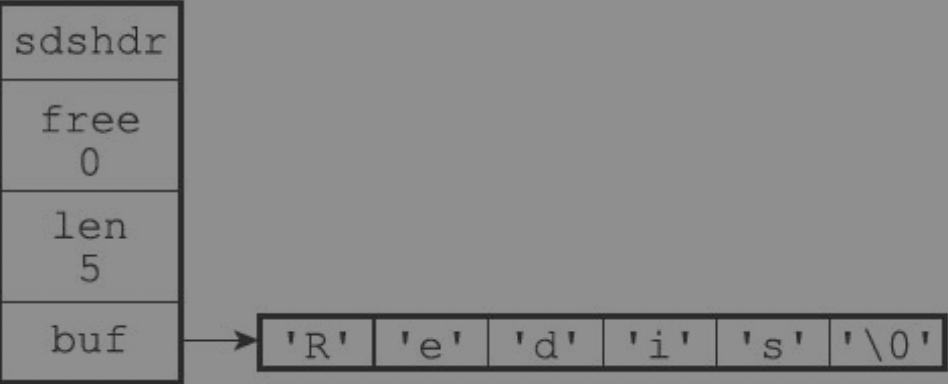

#### 特点

- **常数复杂度获取字符串长度**
  直接从free、len属性获取

- **杜绝缓冲区溢出**
  C语言字符串拼接时都假定分配的内存足够，如果这个假定不成立就会产生缓冲区溢出；
  当SDS API需要对SDS进行修改时，API会先检查SDS的空间是否满足修改所需的要求，如果不满足的话，**API会自动将SDS的空间扩展至执行修改所需的大小**，然后才执行实际的修改操作，所以使用SDS既不需要手动修改SDS的空间大小，也不会出现前面所说的缓冲区溢出问题

- **减少修改字符串时带来的内存重分配次数**

  有两种手段：

  1. 空间预分配
     扩容的时候，会比所需的内存多分配一部分空闲内存（有两种公示决定额外分配多少内存）

  2. 惰性空间释放

     sds字符串缩短之后，内存不是马上回收，而是作为空闲内存保存

- **二进制安全**

  C字符串中的字符必须符合某种编码（比如ASCII）；sds没有这个限制；

- **兼容部分C字符串函数**

  如果我们有一个保存文本数据的SDS值sds，那么我们就可以重用＜string.h＞/strcasecmp函数，使用它来对比SDS保存的字符串和另一个C字符串：

### 链表

#### 示例图

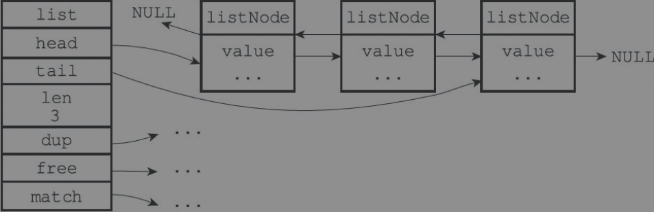

#### 特点

- 双端
- 无环
- 带表头、表尾指针
- 带长度计数器
- 多态；可以保存不通类型的值

### 字典

#### 示例图

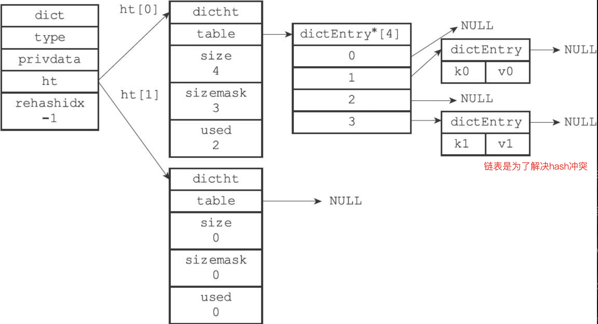

ht属性是一个包含两个项的数组，数组中的每个项都是一个dictht哈希表，一般情况下，字典只使用ht[0]哈希表，ht[1]哈希表只会在对ht[0]哈希表进行rehash时使用。

#### 扩容

1. 服务器目前没有在执行BGSAVE命令或者BGREWRITEAOF命令，并且哈希表的负载因子大于等于1。

2. 服务器目前正在执行BGSAVE命令或者BGREWRITEAOF命令，并且哈希表的负载因子大于等于5。

#### 收缩

当哈希表的负载因子小于0.1时，程序自动开始对哈希表执行收缩操作。

#### 渐进式rehash

以下是哈希表渐进式rehash的详细步骤：

1）为ht[1]分配空间，让字典同时持有ht[0]和ht[1]两个哈希表。

2）在字典中维持一个索引计数器变量rehashidx，并将它的值设置为0，表示rehash工作正式开始。

3）在rehash进行期间，每次对字典执行添加、删除、查找或者更新操作时，程序除了执行指定的操作以外，还会顺带将ht[0]哈希表在rehashidx索引上的所有键值对rehash到ht[1]，当rehash工作完成之后，程序将rehashidx属性的值增一。

4）随着字典操作的不断执行，最终在某个时间点上，ht[0]的所有键值对都会被rehash至ht[1]，这时程序将rehashidx属性的值设为-1，表示rehash操作已完成。

渐进式rehash的好处在于它采取分而治之的方式，将rehash键值对所需的计算工作均摊到对字典的每个添加、删除、查找和更新操作上，从而避免了集中式rehash而带来的庞大计算量。

另外，在渐进式rehash执行期间，新添加到字典的键值对一律**会被保存到ht[1]**里面，而ht[0]则不再进行任何添加操作，这一措施保证了ht[0]包含的键值对数量会只减不增，并随着rehash操作的执行而最终变成空表。

### 跳跃表

#### 示例图

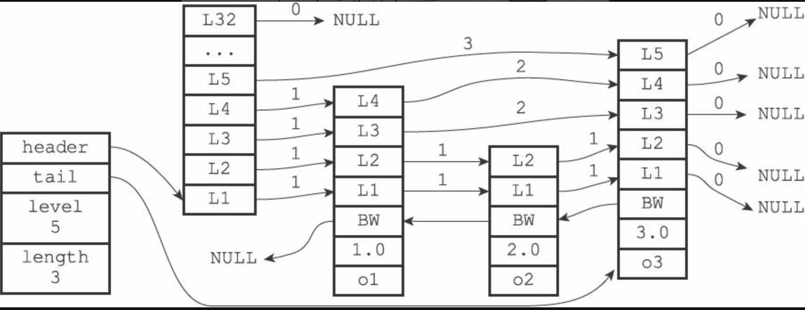

Redis只在两个地方用到了跳跃表，一个是实现有序集合键，另一个是在集群节点中用作内部数据结构。

每个跳跃表节点的层高都是1至32之间的随机数

### 整数集合

整数集合（intset）是集合键的底层实现之一，当一个集合**只包含整数值元素**，并且这个集合的**元素数量不多**时，Redis就会使用整数集合作为集合键的底层实现。

#### 示例图

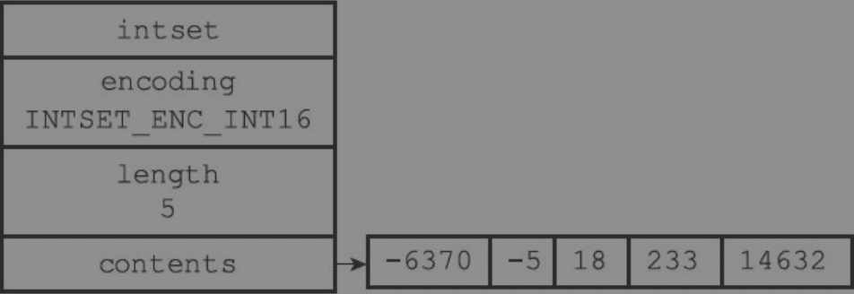

当向一个底层为int16_t数组的整数集合添加一个int64_t类型的整数值时，整数集合已有的所有元素都会被转换成int64_t类型

#### 升级

类型：int16_t，int32_t，int64_t

当向一个底层为int16_t数组的整数集合添加一个int64_t类型的整数值时，整数集合已有的所有元素都会被转换成int64_t类型；

整数集合**不支持降级**操作，一旦对数组进行了升级，编码就会一直保持升级后的状态。

**好处**：整数集合的升级策略有两个好处，一个是提升整数集合的灵活性，另一个是尽可能地节约内存。

### 压缩列表

压缩列表（ziplist）是列表键和哈希键的底层实现之一。当一个列表键只包含少量列表项，并且每个列表项要么就是小整数值，要么就是长度比较短的字符串，那么Redis就会使用压缩列表来做列表键的底层实现

#### 示例图

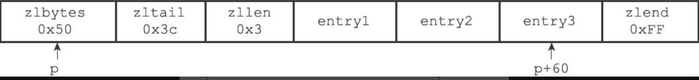

#### 连锁更新

每个节点的previous_entry_length属性都记录了前一个节点的长度：

❑如果前一节点的长度小于254字节，那么previous_entry_length属性需要用1字节长的空间来保存这个长度值。

❑如果前一节点的长度大于等于254字节，那么previous_entry_length属性需要用5字节长的空间来保存这个长度值。

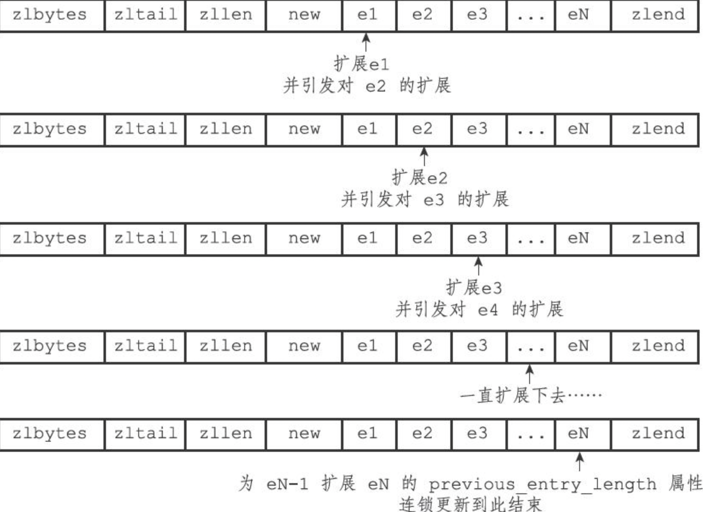

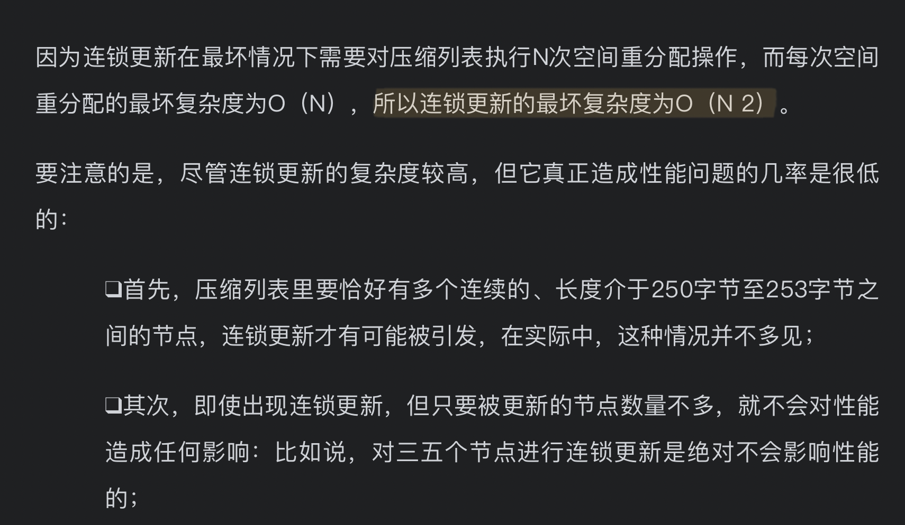

### 对象

Redis的对象系统还实现了基于引用计数技术的内存回收机制，当程序不再使用某个对象的时候，这个对象所占用的内存就会被自动释放；

#### 结构

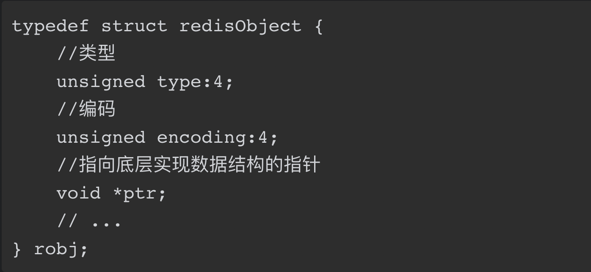

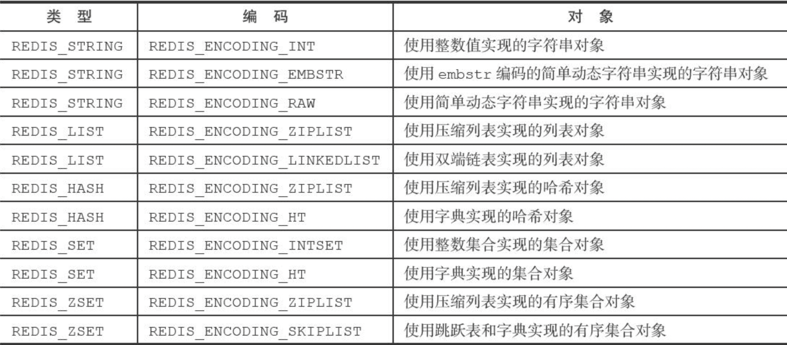

#### 共享对象

Redis只对包含整数值的字符串对象进行共享。

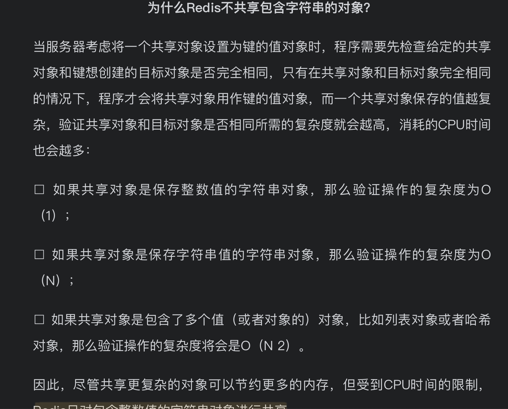

假设键A创建了一个包含整数值100的字符串对象作为值对象，如果这时键B也要创建一个同样保存了整数值100的字符串对象作为值对象，那么服务器让键A和键B共享同一个字符串对象；

Redis会在初始化服务器时，创建一万个字符串对象，这些对象包含了从0到9999的所有整数值，当服务器需要用到值为0到9999的字符串对象时，服务器就会使用这些共享对象，而不是新创建对象。

# 第二部分：单机数据库的实现

## 数据库

#### 示例图

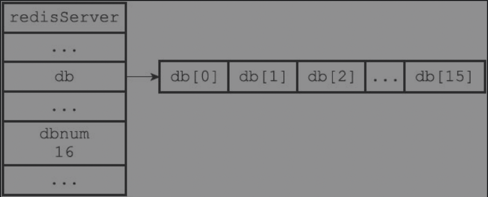

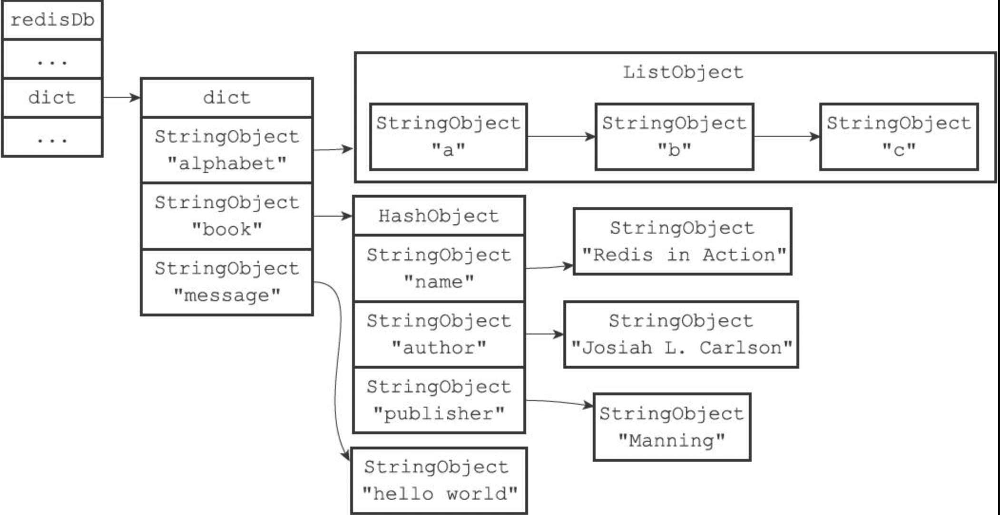

#### 过期时间

保存过期时间

redisDb结构的expires字典保存了数据库中所有键的过期时间，我们称这个字典为过期字典：

❑过期字典的键是一个指针，这个指针指向键空间中的某个键对象（也即是某个数据库键）。

❑过期字典的值是一个long long类型的整数，这个整数保存了键所指向的数据库键的过期时间——一个毫秒精度的UNIX时间戳。

##### 过期键删除策略

Redis服务器实际使用的是**惰性删除**和**定期删除**两种策略：通过配合使用这两种删除策略，服务器可以很好地在合理使用CPU时间和避免浪费内存空间之间取得平衡。

- 惰性删除

  操作键的时候判断一下键是否过期，如果过期了则删除键，并且按照键不存在的方式处理命令

- 定期删除
  过期键的定期删除策略由redis.c/activeExpireCycle函数实现，每当Redis的服务器周期性操作redis.c/serverCron函数执行时，activeExpireCycle函数就会被调用，**它在规定的时间内，分多次遍历服务器中的各个数据库**，从数据库的expires字典中**随机**检查一部分键的过期时间，并删除其中的过期键。

##### AOF、RDB和复制功能对过期键的处理

-  生成RDB文件
  在执行SAVE命令或者BGSAVE命令创建一个新的RDB文件时，程序会对数据库中的键进行检查，**已过期的键不会被保存**到新创建的RDB文件中。

- 载入RDB文件

  如果服务器以主服务器模式运行，那么在载入RDB文件时，程序会对文件中保存的键进行检查，未过期的键会被载入到数据库中，而**过期键则会被忽略，所以过期键对载入RDB文件的主服务器不会造成影响**。如果是从服务器模式的话会**所有键都载入**，但是因为进行数据同步的时候从服务器的数据库会被清空，所以不会对数据库造成影响。

- AOF文件写入
  当过期键被惰性删除或者定期删除之后，程序会向AOF文件追加（append）一条DEL命令，来显式地记录该键已被删除。

- AOF重写
  和生成RDB文件时类似，在执行AOF重写的过程中，程序会对数据库中的键进行检查，**已过期的键不会被保存到重写后的AOF文件中。**

- 复制
  主服务器在删除一个过期键之后，会显式地向所有从服务器发送一个DEL命令，告知从服务器删除这个过期键。从服务器只有在接到主服务器发来的DEL命令之后，才会删除过期键。

## RDB持久化

RDB文件是一个经过压缩的二进制文件，由多个部分组成

有两个Redis命令可以用于生成RDB文件，一个是SAVE，另一个是BGSAVE。

- SAVE
  SAVE命令会阻塞Redis服务器进程，直到RDB文件创建完毕为止，在服务器进程阻塞期间，服务器不能处理任何命令请求

- BGSAVE
  BGSAVE命令会派生出一个子进程，然后由子进程负责创建RDB文件，服务器进程（父进程）继续处理命令请求

### RDB载入

启动的时候自动载入

如果服务器开启了AOF持久化功能，那么服务器会**优先使用AOF文件**来还原数据库状态。只有在AOF持久化功能处于关闭状态时，服务器才会使用RDB文件来还原数据库状态。

### 自动保存

因为BGSAVE命令可以在不阻塞服务器进程的情况下执行，所以Redis允许用户通过设置服务器配置的save选项，让服务器每隔一段时间自动执行一次BGSAVE命令。

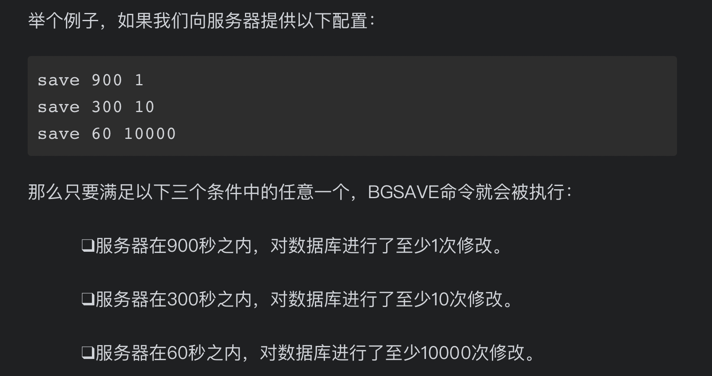

#### 实现方式

数据库维护dirty计数器和lastsave属性

Redis的服务器周期性操作函数**serverCron**默认每隔100毫秒就会执行一次，该函数用于对正在运行的服务器进行维护，它的其中一项工作就是检查save选项所设置的保存条件是否已经满足，如果满足的话，就执行BGSAVE命令。

## AOF持久化

### AOF文件的写入与同步

因为服务器在处理文件事件时可能会执行写命令，使得一些内容被追加到aof_buf缓冲区里面，所以在服务器每次结束一个事件循环之前，它都会调用fushAppendOnlyFile函数，考虑是否需要将aof_buf缓冲区中的内容写入和保存到AOF文件里面

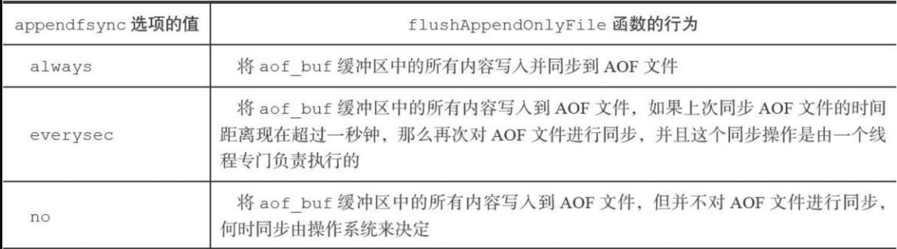

### AOF文件的载入与数据还原

Redis读取AOF文件并还原数据库状态的详细步骤如下：

1）创建一个不带网络连接的伪客户端（fake client）

2）从AOF文件中分析并读取出一条写命令。

3）使用伪客户端执行被读出的写命令。

4）一直执行步骤2和步骤3，直到AOF文件中的所有写命令都被处理完毕为止。

### AOF重写

虽然Redis将生成新AOF文件替换旧AOF文件的功能命名为“AOF文件重写”，但实际上，AOF文件重写并不需要对现有的AOF文件进行任何读取、分析或者写入操作，这个功能是通过读取服务器当前的数据库状态来实现的。

首先从数据库中读取键现在的值，然后用一条命令去记录键值对，代替之前记录这个键值对的多条命令，这就是AOF重写功能的实现原理。

### AOF后台重写

Redis不希望AOF重写造成服务器无法处理请求，所以Redis决定将AOF重写程序放到子进程里执行。

子进程在重写期间，父进程还在接收命令，会出现数据不一致的情况。为了解决这种数据不一致问题，Redis服务器设置了一个AOF重写缓冲区，这个缓冲区在服务器创建子进程之后开始使用，当Redis服务器执行完一个写命令之后，它会同时将这个写命令发送给AOF缓冲区和AOF重写缓冲区。

当子进程完成AOF重写工作之后，它会向父进程发送一个信号，父进程在接到该信号之后，会调用一个信号处理函数，并执行以下工作：

1. 将AOF重写缓冲区中的所有内容写入到新AOF文件中，这时新AOF文件所保存的数据库状态将和服务器当前的数据库状态一致。
2. 对新的AOF文件进行改名，原子地（atomic）覆盖现有的AOF文件，完成新旧两个AOF文件的替换。

## 事件

Redis服务器是一个事件驱动程序，服务器需要处理以下两类事件：

- 文件事件（file event）：Redis服务器通过套接字与客户端（或者其他Redis服务器）进行连接，而文件事件就是服务器对套接字操作的抽象。服务器与客户端（或者其他服务器）的通信会产生相应的文件事件，而服务器则通过监听并处理这些事件来完成一系列网络通信操作。

- 时间事件（time event）：Redis服务器中的一些操作（比如serverCron函数）需要在给定的时间点执行，而时间事件就是服务器对这类定时操作的抽象。

### 文件事件

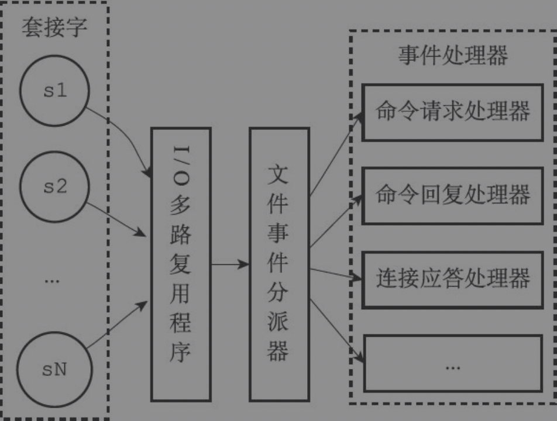

尽管多个文件事件可能会并发地出现，但I/O多路复用程序总是会将所有产生事件的套接字都放到一个队列里面，然后通过这个队列，以有序（sequentially）、同步（synchronously）、每次一个套接字的方式向文件事件分派器传送套接字

#### 文件事件的处理器

Redis为文件事件编写了多个处理器，这些事件处理器分别用于实现不同的网络通信需求，比如说：

- 为了对连接服务器的各个客户端进行应答，服务器要为监听套接字关联**连接应答处理器**。
  当**Redis服务器进行初始化**的时候，程序会将这个连接应答处理器和服务器监听套接字的**AE_READABLE**事件关联起来，当有客户端用sys/socket.h/connect函数连接服务器监听套接字的时候，套接字就会产生AE_READABLE事件，引发连接应答处理器执行，并执行相应的套接字应答操作。

- 为了接收客户端传来的命令请求，服务器要为客户端套接字关联**命令请求处理器**。
  当一个客户端**通过连接应答处理器成功连接到服务器**之后，服务器会将客户端套接字的**AE_READABLE**事件和命令请求处理器关联起来，当客户端向服务器发送命令请求的时候，套接字就会产生AE_READABLE事件，引发命令请求处理器执行，并执行相应的套接字读入操作。在客户端连接服务器的整个过程中，服务器都会一直为客户端套接字的AE_READABLE事件关联命令请求处理器。

- 为了向客户端返回命令的执行结果，服务器要为客户端套接字关联**命令回复处理器**。
  当**服务器有命令回复需要传送给客户端的时候**，服务器会将客户端套接字的AE_WRITABLE事件和命令回复处理器关联起来，当客户端准备好接收服务器传回的命令回复时，就会产生AE_WRITABLE事件，引发命令回复处理器执行，并执行相应的套接字写入操作。当服务器有命令回复需要传送给客户端的时候，服务器会将客户端套接字的AE_WRITABLE事件和命令回复处理器关联起来。当命令回复发送完毕之后，服务器就会**解除**命令回复处理器与客户端套接字的AE_WRITABLE事件之间的关联。

- 当主服务器和从服务器进行复制操作时，主从服务器都需要关联特别为复制功能编写的复制处理器。

### 时间事件

Redis的时间事件分为以下两类：

- 定时事件：让一段程序在指定的时间之后执行一次。比如说，让程序X在当前时间的30毫秒之后执行一次。

- 周期性事件：让一段程序每隔指定时间就执行一次。比如说，让程序Y每隔30毫秒就执行一次。

目前版本的Redis只使用周期性事件，而没有使用定时事件。

#### 实现

服务器将所有时间事件都放在一个无序链表中，每当时间事件执行器运行时，它就**遍历整个链表**，查找所有已到达的时间事件，并调用相应的事件处理器。

在目前版本中，正常模式下的Redis服务器只使用serverCron一个时间事件，在这种情况下，服务器几乎是将**无序链表退化成一个指针来使用**，所以使用无序链表来保存时间事件，**并不影响事件执行的性能**。

## 客户端

Redis通过使用由I/O多路复用技术实现的文件事件处理器，Redis服务器使用单线程单进程的方式来处理命令请求，并与多个客户端进行网络通信。

Redis服务器状态结构的clients属性是一个链表，这个链表保存了所有与服务器连接的客户端的状态结构，对客户端执行批量操作，或者查找某个指定的客户端，都可以通过遍历clients链表来完成。

### 属性

1. 客户端的套接字描述符。
2. 客户端的名字。
3. 客户端的标志值（fag）。
4. 指向客户端正在使用的数据库的指针，以及该数据库的号码。
5. 客户端当前要执行的命令、命令的参数、命令参数的个数，以及指向命令实现函数的指针。
6. 客户端的输入缓冲区和输出缓冲区。
7. 客户端的复制状态信息，以及进行复制所需的数据结构。
8. 客户端执行BRPOP、BLPOP等列表阻塞命令时使用的数据结构。
9. 客户端的事务状态，以及执行WATCH命令时用到的数据结构。
10. 客户端执行发布与订阅功能时用到的数据结构。
11. 客户端的身份验证标志。
12. 客户端的创建时间，客户端和服务器最后一次通信的时间，以及客户端的输出缓冲区大小超出软性限制（soft limit）的时间。

### 示例图

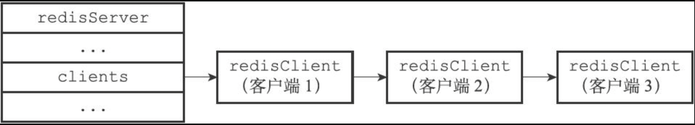

### 注意

通常情况下，Redis只会将那些对数据库进行了修改的命令写入到AOF文件，并复制到各个从服务器。如果一个命令没有对数据库进行任何修改，那么它就会被认为是只读命令，这个命令不会被写入到AOF文件，也不会被复制到从服务器。

以上规则适用于绝大部分Redis命令，但PUBSUB命令和SCRIPT LOAD命令是其中的例外。PUBSUB命令虽然没有修改数据库，但PUBSUB命令向频道的所有订阅者发送消息这一行为带有副作用，接收到消息的所有客户端的状态都会因为这个命令而改变。因此，服务器需要使用REDIS_FORCE_AOF标志，强制将这个命令写入AOF文件，这样在将来载入AOF文件时，服务器就可以再次执行相同的PUBSUB命令，并产生相同的副作用。

### 伪客户端

1. Lua

   lua_client伪客户端在服务器运行的整个生命期中会一直存在，只有服务器被关闭时，这个客户端才会被关闭。

2. 载入AOF文件

   服务器在载入AOF文件时，会创建用于执行AOF文件包含的Redis命令的伪客户端，并在载入完成之后，关闭这个伪客户端。

## 服务器

### 命令请求的执行过程（重要）

1. 发送命令请求

   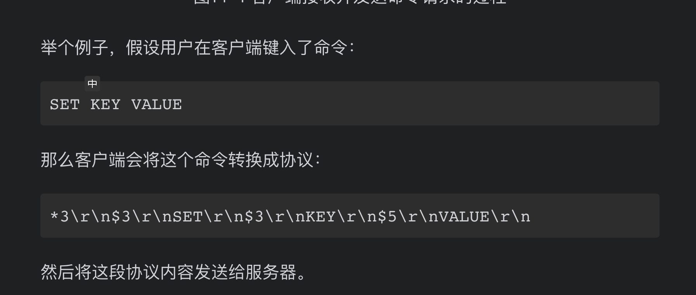

2. 读取命令请求
   当客户端与服务器之间的**连接套接字**因为客户端的写入而变得**可读**时，服务器将调用**命令请求处理器**来执行以下操作：

   - 读取套接字中协议格式的命令请求，并将其保存到客户端状态的**输入缓冲区**里面。
   - 对输入缓冲区中的命令请求进行**分析**，提取出命令请求中包含的**命令参数**，以及命令参数的个数，然后分别将参数和参数个数保存到客户端状态的argv属性和argc属性里面。
   - 调用**命令执行器**，执行客户端指定的命令。

   命令执行器：

   - 去命令表查找**命令的实现函数**
   - 执行预备操作：
     1. 检查参数是否正确； 
     2. 检查身份是否验证； 
     3. 检查内存使用情况
     4. 检查是否在订阅模式，如果是，只会接收SUBSCRIBE、PSUBSCRIBE、UNSUBSCRIBE、PUNSUBSCRIBE四个命令
     5. 检查是否在Lua脚本阻塞状态，如果是则拒绝命令
     6. 检查是否在执行事务，如果是则只会执行EXEC、DISCARD、MULTI、WATCH四个命令
     7. 检查服务器是否在进行数据载入，如果是则客户端发送的命令必须带有l标识（比如INFO、SHUTDOWN、PUBLISH等等）才会被服务器执行
   - 调用**命令的实现函数**，并将结果放在输出缓冲区
   - 执行后续工作
     1. 记录慢查询日志
     2. 记录aop文件
     3. 如果有从服务器复制这个服务器，则会执行命令传播给所有从服务器
     4. 记录调用次数

3. 将命令回复给客户端
   当客户端套接字变为**可写状态**时，服务器就会执行**命令回复处理器**，将保存在客户端**输出缓冲区**中的命令回复发送给客户端。

4. 客户端打印回复内容

### serverCron函数

每100ms运行一次

#### 作用：

1. 更新服务器时间缓存
   避免每次获取时间的时候都执行系统调用，直接在内存中维护了时间
2. 更新服务器每秒执行的次数
3. 更新服务器内存峰值记录
4. 处理SIGTERM信号
5. 管理客户端资源
   如果客户端链接超时则会释放这个客户端；如果输入缓冲区的大小超过了一定的长度，则会释放当前的输入缓冲区，并重新创建一个，以防客户端的输入缓冲区耗费太多内存。
6. 管理数据库资源
   删除过期键
7. 执行被延迟的BGREWRITEAOF
8. 将AOF缓冲区中的内容写入AOF文件
9. 关闭异步客户端

### 初始化服务器

一个Redis服务器从启动到能够接受客户端的命令请求，需要经过一系列的初始化和设置过程，比如初始化服务器状态，接受用户指定的服务器配置，创建相应的数据结构和网络连接等等。

# 第三部分：多机数据库的实现

## 复制

在Redis中，用户可以通过执行SLAVEOF命令或者设置slaveof选项，让一个服务器去复制（replicate）另一个服务器，我们称呼被复制的服务器为主服务器（master），而对主服务器进行复制的服务器则被称为从服务器（slave）。

#### 旧版复制功能

Redis的复制功能分为**同步**（sync）和**命令传播**（command propagate）两个操作：

##### 同步

从服务器对主服务器的同步操作需要通过向主服务器发送**SYNC命令**来完成，以下是SYNC命令的执行步骤：

1. 从服务器向主服务器发送SYNC命令。
2. 收到SYNC命令的主服务器执行BGSAVE命令，在**后台**生成一个RDB文件，并使用一个**缓冲区记录从现在开始执行的所有写命令**。
3. 当主服务器的BGSAVE命令执行完毕时，主服务器会将BGSAVE命令生成的RDB文件发送给从服务器，从服务器接收并载入这个RDB文件，将自己的数据库状态更新至主服务器执行BGSAVE命令时的数据库状态。
4. 主服务器将记录在缓冲区里面的所有写命令发送给从服务器，从服务器执行这些写命令，将自己的数据库状态更新至主服务器数据库当前所处的状态。

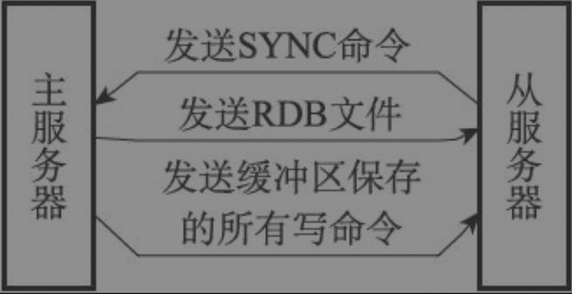

##### 命令传播

为了让主从服务器再次回到一致状态，主服务器需要对从服务器执行命令传播操作：主服务器会将自己执行的写命令，也即是造成主从服务器不一致的那条写命令，发送给从服务器执行，当从服务器执行了相同的写命令之后，主从服务器将再次回到一致状态。

##### 缺陷

SYNC命令是一个非常耗费资源的操作（主服务器需要生成RDB文件，从服务器需要载入RDB文件，网络需要传输RDB文件）；当从服务器断线重连之后，需要通过SYNC从头同步整个数据库。

#### 新版复制功能

使用PSYNC命令代替SYNC命令来执行复制时的同步操作。PSYNC命令具有完整重同步（full resynchronization）和部分重同步（partialresynchronization）两种模式。

##### 完整重同步

用于初次复制的情况

##### 部分重同步

主服务器维护一个固定长度的**复制积压缓冲区**

从服务器断线重新复制的时候，告诉主服务器复制的偏移量，主服务器如果发现断线期间新增的数据还在**复制积压缓冲区**中，则会执行部分重同步，否则执行完整重同步。

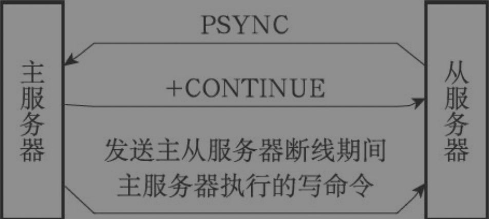

## Sentinel

Sentinel（哨岗、哨兵）是Redis的**高可用性**（high availability）解决方案：由一个或多个Sentinel实例（instance）组成的Sentinel系统（system）可以监视任意多个主服务器，以及这些主服务器属下的所有从服务器，并在被监视的主服务器进入下线状态时，自动将下线主服务器属下的某个从服务器升级为新的主服务器，然后由新的主服务器代替已下线的主服务器继续处理命令请求。

### 启动

#### 启动并初始化Sentinel

1. 首先，因为Sentinel本质上只是一个运行在特殊模式下的Redis服务器，所以启动Sentinel的第一步，就是初始化一个普通的Redis服务器。

2. 启动Sentinel的第二个步骤就是将一部分普通Redis服务器使用的代码替换成Sentinel专用代码
3. 在应用了Sentinel的专用代码之后，接下来，服务器会初始化一个sentinel.c/sentinelState结构（后面简称“Sentinel状态”），这个结构保存了服务器中所有和Sentinel功能有关的状
4. 初始化Sentinel状态的masters属性
5. 初始化Sentinel的最后一步是创建连向被监视主服务器的网络连接，Sentinel将成为主服务器的客户端，它可以向主服务器发送命令，并从命令回复中获取相关的信息。

#### 获取主服务器的信息

Sentinel默认会以每十秒一次的频率，通过命令连接向被监视的主服务器发送INFO命令，并通过分析INFO命令的回复来获取主服务器的当前信息。

#### 获取从服务器的信息

当Sentinel发现主服务器有新的从服务器出现时，Sentinel除了会为这个新的从服务器创建相应的实例结构之外，Sentinel还会创建连接到从服务器的命令连接和订阅连接。在创建命令连接之后，Sentinel在默认情况下，会以每十秒一次的频率通过命令连接向从服务器发送INFO命令。

#### 向主服务器和从服务器发送信息

在默认情况下，Sentinel会以每两秒一次的频率，通过命令连接向所有被监视的主服务器和从服务器发送命令告诉监视的服务器自己的信息。

#### 接收来自主服务器和从服务器的频道信息

对于每个与Sentinel连接的服务器，Sentinel既通过命令连接向服务器的__sentinel__:hello频道发送信息，又通过订阅连接从服务器的__sentinel__:hello频道接收信息。

对于监视同一个服务器的多个Sentinel来说，一个Sentinel发送的信息会被其他Sentinel接收到，这些信息会被用于更新其他Sentinel对发送信息Sentinel的认知，也会被用于更新其他Sentinel对被监视服务器的认知。

因为一个Sentinel可以通过分析接收到的频道信息来**获知其他Sentinel的存在**，并通过发送频道信息来**让其他Sentinel知道自己的存在**，所以用户在使用Sentinel的时候并不需要提供各个Sentinel的地址信息，监视同一个主服务器的多个Sentinel**可以自动发现对方**。

#### 创建连向其他Sentinel的命令连接

当Sentinel通过频道信息发现一个新的Sentinel时，它不仅会为新Sentinel在sentinels字典中创建相应的实例结构，还会创建一个连向新Sentinel的**命令连接**，但不会创建**订阅连接**。

### 故障转移

#### 检测主观下线

在默认情况下，Sentinel会以每秒一次的频率向所有与它创建了命令连接的实例（包括主服务器、从服务器、其他Sentinel在内）发送PING命令，并通过实例返回的PING命令回复来判断实例是否在线。

#### 检测客观下线

当Sentinel将一个主服务器判断为主观下线之后，为了确认这个主服务器是否真的下线了，它会向同样监视这一主服务器的**其他Sentinel进行询问**，看它们是否也认为主服务器已经进入了下线状态（可以是主观下线或者客观下线）。当Sentinel从其他Sentinel那里接收到足够数量的已下线判断之后，Sentinel就会将从服务器判定为**客观下线**，并对主服务器**执行故障转移操作**。

#### 选举领头Sentinel

当一个主服务器被判断为客观下线时，监视这个下线主服务器的各个Sentinel会进行协商，选举出一个领头Sentinel，并由领头Sentinel对下线主服务器执行故障转移操作。

如果有某个Sentinel被半数以上的Sentinel设置成了局部领头Sentinel，那么这个Sentinel成为领头Sentinel

#### 故障转移

1. 在已下线主服务器属下的所有从服务器里面，挑选出一个从服务器，并将其转换为主服务器。
   选举策略：
   - 删除不可用、或者有较长一段时间没有通信的从服务器；
   - 根据优先级比较高、复制偏移量比较大的从服务器中选；
   - 如果都一样，则选举**运行id最小**的那个从服务器；
2. 让已下线主服务器属下的所有从服务器改为复制新的主服务器。
3. 将已下线主服务器设置为新的主服务器的从服务器，当这个旧的主服务器重新上线时，它就会成为新的主服务器的从服务器。

## 集群

Redis集群是Redis提供的分布式数据库方案，集群通过分片（sharding）来进行数据共享，并提供复制和故障转移功能。

### 节点

节点会继续使用redisServer结构来保存服务器的状态，使用redisClient结构来保存客户端的状态，至于那些只有在集群模式下才会用到的数据，节点将它们保存到了**cluster.h/clusterNode结构、cluster.h/clusterLink结构，以及cluster.h/clusterState结构**里面。

#### 集群数据结构

- clusterNode

  **clusterNode结构**保存了一个节点的当前状态，比如节点的创建时间、节点的名字、节点当前的配置纪元、节点的IP地址和端口号。

- clusterLink

  clusterNode结构的link属性是一个**clusterLink结构**，该结构保存了连接节点所需的有关信息，比如套接字描述符，输入缓冲区和输出缓冲区。
  redisClient结构和clusterLink结构都有自己的套接字描述符和输入、输出缓冲区，这两个结构的区别在于，redisClient结构中的套接字和缓冲区是用于**连接客户端**的，而clusterLink结构中的套接字和缓冲区则是用于**连接节点**的。

- clusterState
  每个节点都保存着一个clusterState结构，这个结构记录了在当前节点的视角下，集群目前所处的状态，例如集群是在线还是下线，集群包含多少个节点，集群当前的配置纪元。

### 槽指派

Redis集群通过分片的方式来保存数据库中的键值对：集群的整个数据库被分为16384个槽（slot），数据库中的每个键都属于这16384个槽的其中一个，集群中的每个节点可以处理0个或最多16384个槽。

当数据库中的16384个槽都有节点在处理时，集群处于上线状态（ok）；相反地，如果数据库中有任何一个槽没有得到处理，那么集群处于下线状态（fail）。

通过向节点发送CLUSTER ADDSLOTS命令，我们可以将一个或多个槽指派（assign）给节点负责。

**clusterNode结构**的**slots属性**和numslot属性记录了节点负责处理哪些槽。

#### 传播节点的槽指派信息

一个节点除了会将自己负责处理的槽记录在clusterNode结构的slots属性和numslots属性之外，它还会将自己的slots数组通过消息发送给集群中的其他节点，以此来告知其他节点自己目前负责处理哪些槽。

当节点A通过消息从节点B那里接收到节点B的slots数组时，节点A会在自己的clusterState.nodes字典中查找节点B对应的clusterNode结构，并对结构中的slots数组进行**保存或者更新**。

#### 记录集群所有槽的指派信息

clusterState结构中的slots数组记录了集群中所有16384个槽的指派信息

slots数组包含16384个项，每个数组项都是一个指向clusterNode结构的指针：

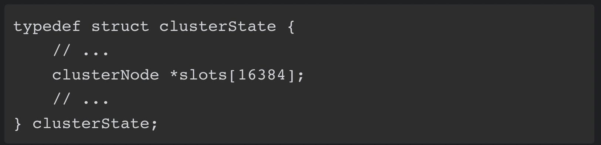

#### 注意

clusterNode.slots数组和clusterState.slots数组都保存了槽指派信息；为什么分两份存，主要是考虑操作性能。

### 在集群中执行命令

当客户端向节点发送与数据库键有关的命令时，接收命令的节点会计算出命令要处理的数据库键属于哪个槽，并检查这个槽是否指派给了自己：

1. 如果键所在的槽正好就指派给了当前节点，那么节点直接执行这个命令。

2. 如果键所在的槽并没有指派给当前节点，那么节点会向客户端返回一个**MOVED错误**，指引客户端转向（redirect）至正确的节点，并再次发送之前想要执行的命令。

### 节点数据库的实现

集群节点保存键值对以及键值对过期时间的方式

节点和单机服务器在数据库方面的一个区别是，**节点只能使用0号数据库**，而单机Redis服务器则没有这一限制。

### 复制与故障转移

Redis集群中的节点分为主节点（master）和从节点（slave），其中主节点用于处理槽，而从节点则用于复制某个主节点，并在被复制的主节点下线时，代替下线主节点继续处理命令请求。

一个节点成为从节点，并开始复制某个主节点这一信息会通过消息发送给集群中的其他节点，最终集群中的所有节点都会知道某个从节点正在复制某个主节点。

集群中的所有节点都会在代表主节点的clusterNode结构的slaves属性和numslaves属性中记录正在复制这个主节点的从节点名单。

#### 故障检测

集群中的每个节点都会定期地向集群中的其他节点发送PING消息，以此来检测对方是否在线，如果接收PING消息的节点没有在规定的时间内，向发送PING消息的节点返回PONG消息，那么发送PING消息的节点就会将接收PING消息的节点标记为**疑似下线**（probable fail，PFAIL）。

如果在一个集群里面，**半数**以上负责处理槽的主节点都将某个主节点x报告为**疑似下线**，那么这个主节点x将被标记为**已下线**

#### 故障转移

当一个从节点发现自己正在复制的主节点进入了已下线状态时，从节点将开始对下线主节点进行故障转移，以下是故障转移的执行步骤：

1. 复制下线主节点的所有从节点里面，会有一个从节点被选中。
2. 被选中的从节点会执行SLAVEOF no one命令，成为新的主节点。
3. 新的主节点会撤销所有对已下线主节点的槽指派，并将这些槽全部指派给自己。
4. 新的主节点向集群广播一条PONG消息，这条PONG消息可以让集群中的其他节点立即知道这个节点已经由从节点变成了主节点，并且这个主节点已经接管了原本由已下线节点负责处理的槽。
5. 新的主节点开始接收和自己负责处理的槽有关的命令请求，故障转移完成。